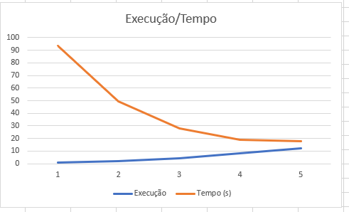
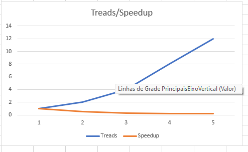
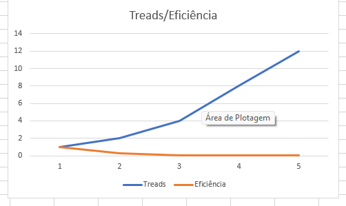

# Relatório da NOME DA ATIVIDADE

**Disciplina:** 
**Aluno(s):**
**Turma:**
**Professor:**
**Data:**

---

# 1. Descrição do Problema

## Orientações para preenchimento

Explique:

* Qual problema foi implementado
* Qual algoritmo foi utilizado
* Qual o tamanho da entrada utilizada nos testes
* Qual o objetivo da paralelização

**Questões que devem ser respondidas:**

* Qual é o objetivo do programa?
  O objetivo é extrair métricas como número de linhas, palavras, caracteres e ocorrência de palavras-chave (erro, warning e info).

* Qual o volume de dados processado?
  O volume de dados utilizado nos testes corresponde ao conjunto log2, contendo milhões de registros.
  
* Qual algoritmo foi utilizado?
  O algoritmo utilizado realiza leitura sequencial dos arquivos e contagem de ocorrências.

* Qual a complexidade aproximada do algoritmo?
  A complexidade do algoritmo é O(n), onde n representa o número total de linhas dos arquivos.

---

# 2. Ambiente Experimental

Descreva o ambiente em que os experimentos foram realizados.

## Orientações

Informar as características do hardware e software utilizados na execução dos testes.

| Item                        | Descrição |
| --------------------------- | --------- |
| Processador                 |12th Gen Intel(R) Core(TM) i5-12500 3.00 GHz|
| Número de núcleos           |6 núcleos (cores) físicos|
| Memória RAM                 |16,0 GB (utilizável: 15,7 GB)|
| Sistema Operacional         |Windows 11 Pro|
| Linguagem utilizada         |Python|
| Biblioteca de paralelização |concurrent.futures|
| Compilador / Versão         |CPython/ 3.13|

---

# 3. Metodologia de Testes

- 1 processo (serial)
- 2 processos
- 4 processos
- 8 processos
- 12 processos
Explique como os experimentos foram conduzidos.

## Orientações

Descrever:

* Como o tempo de execução foi medido
* Quantas execuções foram realizadas
* Se foi utilizada média dos tempos
* Qual tamanho da entrada foi usado

### Configurações testadas

Os experimentos devem ser realizados nas seguintes configurações:

* 1 thread/processo (versão serial)
* 2 threads/processos
* 4 threads/processos
* 8 threads/processos
* 12 threads/processos

### Procedimento experimental

Descrever:

* Número de execuções para cada configuração
  Cada configuração de paralelismo (1, 2, 4, 8 e 12 processos) foi executada 3 vezes, sendo utilizado o valor médio dos tempos para reduzir variações experimentais.
  
* Forma de cálculo da média
  O cálculo da média foi feito somando os tempos de cada execução e dividindo pelo número de repetições.
  
* Condições de execução (ex: máquina dedicada, carga do sistema, etc.)
As execuções foram realizadas em máquina local, não dedicada, podendo haver variações de desempenho devido a processos em segundo plano e uso do sistema operacional durante os testes.

---

# 4. Resultados Experimentais

Preencha a tabela com os **tempos médios de execução** obtidos.

## Orientações

* O tempo deve ser informado em **segundos**
* Utilizar a **média das execuções**

| Nº Threads/Processos | Tempo de Execução (s) |
| -------------------- | --------------------- |
| 1                    | 93,26                 |
| 2                    | 49,51                 |
| 4                    | 28,27                 |
| 8                    | 18,70                 |
| 12                   | 17,99                 |

---

# 5. Cálculo de Speedup e Eficiência

## Fórmulas Utilizadas

### Speedup

```
Speedup(p) = T(1) / T(p)
```

Onde:

* **T(1)** = tempo da execução serial
* **T(p)** = tempo com p threads/processos

### Eficiência

```
Eficiência(p) = Speedup(p) / p
```

Onde:

* **p** = número de threads ou processos

---

# 6. Tabela de Resultados

Preencha a tabela abaixo utilizando os tempos medidos.

| Processos | Tempo (s) | Speedup | Eficiência |
|----------|----------|--------|-----------|
| 1        | 93.26    | 1.00   | 100%      |
| 2        | 49.52    | 1.88   | 27%       |
| 4        | 28.27    | 3.30   | 8%        |
| 8        | 18.70    | 4.99   | 3%        |
| 12       | 17.99    | 5.18   | 2%        |


---

# 7. Gráfico de Tempo de Execução

Construa um gráfico mostrando o **tempo de execução em função do número de threads/processos**.

## Orientações

* Eixo X: número de threads/processos
* Eixo Y: tempo de execução (segundos)

Inserir o gráfico abaixo:



---

# 8. Gráfico de Speedup

Construa um gráfico mostrando o **speedup obtido**.

## Orientações

* Eixo X: número de threads/processos
* Eixo Y: speedup
* Incluir também a **linha de speedup ideal (linear)** para comparação

Inserir o gráfico abaixo:



---

# 9. Gráfico de Eficiência

Construa um gráfico mostrando a **eficiência da paralelização**.

## Orientações

* Eixo X: número de threads/processos
* Eixo Y: eficiência
* Valores entre 0 e 1

Inserir o gráfico abaixo:



---

# 10. Análise dos Resultados

Realize uma análise crítica dos resultados obtidos.

## Questões a serem respondidas

* O speedup obtido foi próximo do ideal?
Os resultados mostram que o uso de paralelismo reduz significativamente o tempo de execução.

* A aplicação apresentou escalabilidade?
  A aplicação apresentou escalabilidade parcial, com ganhos significativos até 4 e 8 processos, porém com redução do ganho em 12 processos.

* Em qual ponto a eficiência começou a cair?
  A eficiência começou a cair a partir de 4 processos, tornando-se mais evidente conforme o número de processos aumenta.
  
* O número de threads ultrapassa o número de núcleos físicos da máquina?
  O número de threads/processos se aproxima e pode ultrapassar a quantidade de núcleos físicos da máquina, o que contribui para perda de desempenho devido à concorrência de recursos.
  
* Houve overhead de paralelização?
  Há presença de overhead de paralelização, causado pela criação de processos, distribuição de tarefas e comunicação entre eles.
  

Discutir possíveis causas para:

* perda de desempenho
  As principais causas para a perda de desempenho incluem o custo de sincronização entre processos, limitação de I/O (leitura de arquivos), contenção de memória e cache, além do overhead de gerenciamento do paralelismo.
* gargalos no algoritmo
  O gargalo principal do sistema está relacionado ao acesso ao disco e ao custo de coordenação entre processos.
  
* sincronização entre threads/processos
  ocorre quando múltiplos processos precisam coordenar execução e acesso a recursos compartilhados, gerando espera e redução de desempenho.
  
* comunicação entre processos
  envolve o custo de troca de dados entre processos, que no modelo multiprocessing exige serialização e transferência de informações, aumentando o overhead.
  
* contenção de memória ou cache
  acontece quando vários processos competem pelo mesmo recurso de memória ou cache da CPU, causando atrasos devido a acessos simultâneos e perda de eficiência.

---

# 11. Conclusão

Apresente as conclusões do experimento.

## Sugestões de pontos a comentar

* O paralelismo trouxe ganho significativo de desempenho?
  O uso de paralelismo trouxe ganho significativo de desempenho, reduzindo o tempo de execução em comparação à versão serial.
  
* Qual foi o melhor número de threads/processos?
  O melhor desempenho foi observado entre 8 e 12 processos, onde houve a maior redução no tempo total de processamento.
  
* O programa escala bem com o aumento do paralelismo?
  No entanto, o programa não apresenta escalabilidade linear, pois o aumento do número de processos não resulta em ganho proporcional de desempenho.
  
* Quais melhorias poderiam ser feitas na implementação?
  Isso ocorre devido ao overhead de criação e gerenciamento de processos, além de limitações de I/O e contenção de recursos do sistema.

---
